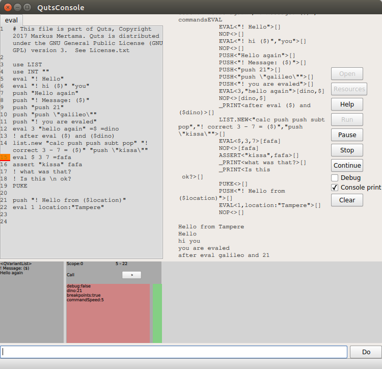

# Quts

## Introduction
Quts is a simple programming language for writing Qt tests and having fun via writing small programs. It is very simple and plain, having a small step for a non-programmer who wants or needs to write a small program with any extra hassle.  

## Features
Loosely stack based imperative language with some functional progeramming twists. The core language is very and focus only on core functionality as program flow. Any other functionality is base on dynamic extensions, subsystems. For example even the integer math it is own subsystem.

Currently implemented subsystems are

*Audio - Audio synthesis, beeper
*Graphics - Drawing primitives
*Float - Floating point math
*Int - Integer math 
*List - Lists
*Qt - Control and manipulate Qt and QML items, objects, signals and slots.
*Store - Persistent storage
*String - Strings
*Time - Get time, timings and run timed events
  
## Install
Quts should be installed for every platfowm Qt 5.9 is available, and it is verified on Windows (tested windows 10), Linux (tested Ubuntu 16.04) and OSX (tested Sierra).

## Using
Open quts.pro in QtCreator and compile. That will generated two applications and a library interface.
Please Look .qts files at test/scripts folder.

### QutsConsole
QutsConsole is a IDE application for quts development, you can use built-in help system, set breakpoints and monitor stack and register content. 




### Command line
Command line interface to run quts files.

### Integrated (for testing)
For using Quts for automated testing you shall embed qutslib using in your application, the API is defined in quts.h header. When you do that in main function the QT subsystem will get access to all QWidgets and QML items in the application. 


### Basic Syntax
Quts program is one or more .qts files. Quts command is set of command lines executed from file begin. Each command line format is command + optional parameters + optional return values. The number of return values can be zero or more, and they are referred using <b>=</b> character. 
```
COMMAND <parameters...> <=return_values...>
```

Most of the commands are taking or returning values implicity or explicitly via stack. <b>$</b> is a special variable that pop a value from a stack and uses that. A Special case is <b>=$</b> return value where return value is pushed on stack.

<b>If</b>, <b>For</b>, <b>Fun</b> and <b>Lambda</b> defines scopes, in the scope local variables are created using <b>var</b> commands, <b>let</b> command creates a global variable. If variable name is not found in the local scope, it is recursively searched from the parent scope. Runtime error occurs if variable is not found.  Scopes are ended with <b>;;</b> command.  

[Quts commands documentation](document/quts_doc.md)

## Example applications
Here are basic features explained by example.


### Hello world
Printing is done using with <b>!</b> command. 

```
! Hello World 
```
### Hello
Functions can be created with <b>fun</b> command and its block is closed using block closing notation <b>;;</b>. In printing ($NAME) refers to value in register, if NAME is omitted, the value printed is popped from the stack. Functions are called with their name and command line is pushed into stack. <b>$</b> is generic stack variable that is popped on every reference.

```
fun hi
    ! Hi ($) !
    ;;

hi "you"
```

### Graphics
Subsystems are dynamically loaded using <b>use</b> command. Subsystem functions are called with <b>.</b> notation. <b>Graphics</b> subsystems have simple drawing primitives e.g. for drawing line. The subsystem creates its own window where graphics are drawn. 

```
use graphics
use time

graphics.line 50 50 150 50 150 200 50 200 50 50

graphics.line 20 240 620 240

graphics.show true

time.sleep 2000
```

### One kind of Fibonacci
There is also possible use named parameters instead of stack. Then variable passed via local variable context. For the <b>use</b> subsystem name can have an alias name, and the alias can also be empty. Therefore <b>calc</b> is actually <b>int.calc</b>. Int subystem has its own stack where values are pushed and popped from the application stack. e.g. <code>int.calc 1 push subt pop</code> can be traslated as push 1 into math stack, push value from from the application stack, then do subtract by pop both values (note that second value is subtracted from the topmost value) and that value is then popped into application stack, which is then popped into register called 'count'. Basically doing expression: count = count - 1. At the end of <b>if</b> block there is a recursive call of fib function. The <b>call</b> here can be omitted.

```
# fibonacci 3         				
use INT ''					
fib n0:0 n1:1 count:20				

fun fib n0 n1 count
! ($n0)
push count
calc 1 push subt pop
pop count
if not count 0
    push n0
    push n1
    calc push push sum pop
    pop n
    call fib n0:n1 n1:n count:count
    ;;
;;
```

### Return values
Return values are stored from stack using with <b>=</b>, otherwise stack is cleaned after function call. 
<b>Eval</b> can create runnable functions from strings and execute them immediately.

```
eval 3 "hello again" =$ =dino
```

### Lambdas
<b>Lambda</b> create functions into stack. The <b>call</b> then can be used to call it. The other ways to use them are e.g. list subsystem iterators or time repeaters.

```
lambda
    ! nameless
    ;;

call $
```

### Events
<b>time</b> has also function to generate timed events. Here a function is pushed on stack, duplicated and given to <b>time.repeater</b> as a parameter. When <b>time.repeat</b> is called those repeaters will be called in every 100 and 1000ms (yet the timing is very unaccurate). The third parameter tells how many times the repeater is called. Last parateters is given to lambda functions.

```
var degree
lambda
    push degree
    inc 1
    push
    pop degree
    tick $ 300 $
    ;;

push

time.repeater 100 $ maxInt "lightblue"
time.repeater 1000 $ maxInt "red"

# default is forever
time.repeat 60000
```


## Using Quts for automated testing
Quts can be used to write automated tests using its <b>Qt</b> library. The quts libraries are linked to your application by adding it in the .pro file
```
LDIR=$$PWD  				# assuming quts.lib is in the working directory
LIBS += -L$$LDIR -lquts  -lobjectfinder # add quts and objectfinder libraries (e.g. .dll in windows )
```
Then in the main function 
```
int main(int argc, char* argv[]) {
    QGuiApplication app(argc, argv);
    QQmlApplicationEngine engine;
    QScopedPointer<Quts::QutsAPI> quts(new Quts::QutsAPI(&engine, Quts::QutsAPI::StdPrint));
    engine.load(QUrl(QStringLiteral("qrc:/main.qml")));

   // Example how then read tests from command line - we delay executing the script to ensure that QML application is propertyly started 
    QTimer timer;
    if(argc > 1) {
        const QString filename(argv[1]);
        timer.setSingleShot(true);
        QObject::connect(&timer, &QTimer::timeout, [&quts, filename]() {
            const auto name = quts->read(filename);
            if(!name.isEmpty()) {
                quts->start(name);
            }
        });
        timer.start(5000);
    }	
```
Then you can access and change QObject and QML values. The <b>find</b> command set the item current by its <code>objectname</code> property. Alternatively
QML <code>id</code> can be searched with <b>fid</b> command. 
```
use QT 
QT.FID "view"
ASSERT
QT.GET "count" =count
! count is ($count)
```


[roadtoquts]:#roadtoquts
## Road to Quts

Basically its story can be dated somewhere back to year 2003 and Doom. I implemented a copy protection system for S60 C2Doom as an interpreter to obfuscate the registration code. That language purpose was to be obscure “write only” language. It featured every command was a single character and program was written as single string. Program was loaded and executed on single 8-bit stack. Therefore program get changed on every step. Furthermore It had only single character hexadecimal numers as command, i.e. ‘9’ was a command that writes int nine into stack and e.g. something like “99*1+!” and writes “82” on console (assuming ‘!’ is a print command). However it was a complete programming language implementing conditional branching and label style jumping.

That engine year later ported Qt a small weeked project - A simple calculator language, the commands were still single characters, but as obfuscation was needed, it had real numbers, separated stack and instruction arrays.  Later I need need a simple test sequence automation, and I reused engine for driving simple command sequences. Quts (Qt User Test System) was there. Since that a lot of changes has been made, but the Qt testing functionality is availale in the QT subsystem. 

The initial Quts language was difficult to program, and to be useful for testing purposes it should be easy. Yet I considered the basic programming model would be very clear for non-programmers: imperative command and its parameters on each line, nothing else.  Initial idea was to keep language very low-level and clean and then write e.g. Python wrapper on top of that, but then I wanted a for-loop. For-loop was an abstraction that enforced me to reconsider many elements in the language. At first labels and goto had to go, as jumping in and out from for loop had confusing side effects. When there was no goto, I had to to implemement “subroutines”, that evolved to be functions. Subroutines and nested for-loops then were reason to have scoped variables.

After choosing that direction Quts have evolved to be a bit easier to program, at least small applications. Therefore I choose publish it if someone would find it fun tool of learn programming, or as a tool for testing engineers to write UI tests for Qt applications. 


